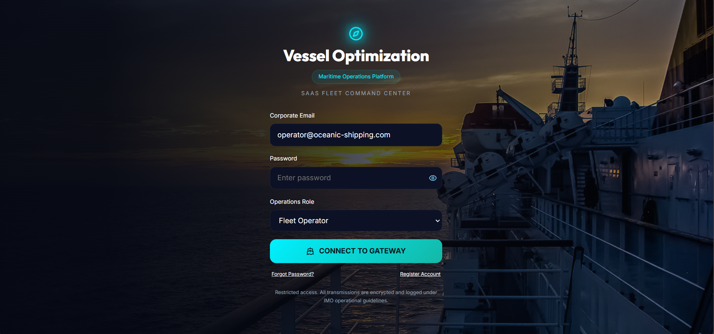

# Vessel Optimization Platform - Maritime SaaS Application

A full-stack maritime Vessel Optimization Platform built to help Operators, Charterers, Technical Managers, and Masters monitor vessel performance, analyze voyage efficiency, identify commercial claim opportunities, and optimize voyage routes based on weather and operational conditions.

The platform combines vessel performance monitoring, weather impact analysis, fuel consumption tracking, claims evaluation, and route optimization into a single enterprise-grade maritime SaaS solution.

---

# Features

### Vessel Performance Monitoring

* Compare Actual Speed vs Warranted Charter Party Speed.
* Compare Actual Fuel Consumption vs Allowed Fuel Consumption.
* Daily vessel performance tracking.
* Voyage-wise performance summaries.
* Speed variance analysis.
* Fuel variance analysis.
* Performance scorecards.

### Voyage Reporting System

Supports operational maritime reports:

* Commencement of Sea Passage (COSP)
* Noon Reports at Sea
* Noon Reports at Port
* Arrival Reports
* Departure Reports
* End of Sea Passage (EOSP)

### Weather Impact Analysis

* Beaufort Scale monitoring.
* Wave Height tracking.
* Swell Direction analysis.
* Current Speed and Direction analysis.
* Wind Speed and Direction analysis.
* Weather risk categorization:

  * Low Risk (Green)
  * Moderate Risk (Amber)
  * High Risk (Red)

### Claims Analysis Engine

* Good Weather Day detection.
* Speed Deficit calculations.
* Fuel Overconsumption calculations.
* Commercial claim opportunity identification.
* Charter Party performance assessment.

### Route Optimization

* Route A vs Route B comparison.
* Weather-based route recommendations.
* ETA predictions.
* Fuel-saving opportunity analysis.
* Weather risk identification.
* Route diversion recommendations.

### Fleet Operations Dashboard

* Fleet KPI overview.
* Active vessels monitoring.
* Active voyage tracking.
* Claims alerts.
* Fuel savings analytics.
* Operational risk alerts.

### Analytics & Reporting

* Vessel Performance Reports.
* Voyage Summary Reports.
* Weather Impact Reports.
* Claims Reports.
* Route Optimization Reports.
* PDF Export functionality.

### Authentication & Authorization

* JWT Authentication.
* Secure login and registration.
* Role-based access control.

Supported Roles:

* Administrator
* Fleet Operator
* Vessel Master
* Technical Manager
* Charterer

---

# Screenshot
  


---

# Technologies Used

## Frontend

* React.js
* Vite
* React Router
* Context API
* Lucide React Icons
* CSS3
* Responsive Design

## Backend

* Node.js
* Express.js
* REST APIs
* JWT Authentication
* Middleware Architecture

## Database

* MongoDB Atlas
* Mongoose ODM

## Maritime Calculation Engines

* Vessel Performance Engine
* Weather Impact Engine
* Claims Evaluation Engine
* Route Optimization Engine
* ETA Prediction Engine
* Fuel Consumption Engine

---

# Database Collections

users

vessels

voyages

cospReports

noonReports

portNoonReports

arrivalReports

departureReports

eospReports

alerts

performanceRecords

routeOptimizations

generatedReports

---

# Installation

## Clone Repository

```bash
git clone <repository-url>
cd vessel-optimization-platform
```

## Backend Setup

```bash
cd backend

npm install
```

Create a .env file:

```env
MONGODB_URI=your_mongodb_connection_string

JWT_SECRET=your_jwt_secret

PORT=5000
```

Run backend:

```bash
npm run dev
```

## Frontend Setup

```bash
cd frontend

npm install

npm run dev
```

---

# Project Workflow

```text
Operational Reports
(COSP, Noon, Arrival, Departure, EOSP)
                ↓

      Data Normalization Layer
                ↓

      MongoDB Data Storage
                ↓

   Performance Analysis Engine
                ↓

      Weather Analysis Engine
                ↓

        Claims Evaluation
                ↓

      Route Optimization
                ↓

      Analytics & Reports
```

---

# Future Enhancements

* Live Weather API Integration
* AIS Vessel Tracking
* Satellite Weather Data
* Machine Learning Fuel Prediction
* AI-Based Route Optimization
* Fleet Benchmarking
* Multi-Tenant SaaS Deployment
* Email & Notification Services

---

# Project Objective

The Vessel Optimization Platform helps maritime stakeholders improve operational efficiency, reduce fuel consumption, identify commercial claim opportunities, and optimize voyage planning through data-driven decision-making.

This project was developed as a full-stack maritime SaaS solution combining vessel performance monitoring and voyage optimization into a single integrated platform.
